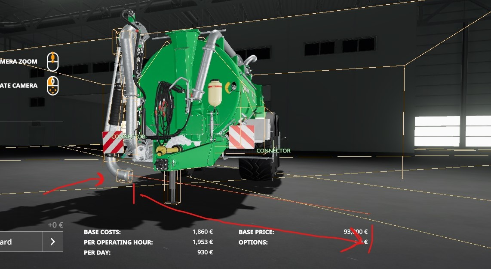
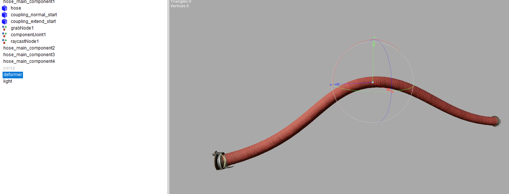

# Modding with vehicles

In this tutorial, you're going to learn how to add ManureSystem support to your vehicle mod.

### What do I need?

To successfully execute the required steps in this tutorial you will need the following programs:

- Text editor ([Notepad++](https://notepad-plus-plus.org/downloads/), [Visual Studio Code](https://code.visualstudio.com/) or any proper IDE ...)
- GIANTS Editor 8.2.0 or 3D software that supports the GIANTS Exporter (Maya, blender ...)
- Internet connection for downloading sources from GitHub

For vehicles you also need an extra script in order to let the `ManureSystem` detect your mod.
You will need to get a copy of the latest `ManureSystemVehicle.lua` file which can be found in the [GitHub repository](https://github.com/stijnwop/manureSystem/tree/master/docs/ManureSystemVehicle.lua).

How to download the `ManureSystemVehicle.lua` file:
1. Go to the `docs` folder located in the root directory.
2. Click on the `ManureSystemVehicle.lua` file.
3. A window will open with the script file.
4. Click on the button called `Raw` next to the `Blame` button and it will open the file in RAW format.
5. Right click and click on `save as` (or hit ctrl - s on your keyboard) and save the file to the preferred location in your mod.

> **REMEMBER: Rename the file extension to `.lua` and don't save it as .txt!**

## Adding the ManureSystemVehicle specialization
> In order to start with this step you need to have completed the part [What do I need?](https://github.com/stijnwop/manureSystem/blob/master/docs/VEHICLES.md#what-do-i-need).

> **TIP: when you don't plan to add extra specializations besides the ManureSystemVehicle and your mod uses the vehicle type `manureBarrel` you don't necessarily have to add the ManureSystemVehicle.lua as the ManureSystem inserts the specs by default for the vehicle type `manureBarrel`**

### Step 1
Open the `modDesc.xml` file located in your mod directory.

In order to load the specialization you will need to add the specializations entry to the modDesc.
```xml
<specializations>
    <specialization name="manureSystemVehicle" className="ManureSystemVehicle" filename="ManureSystemVehicle.lua"/>
</specializations>
```

The filename must be the exact location of the `ManureSystemVehicle.lua` file you downloaded earlier. In this case it's loaded from the root directory of the mod.

If a similar entry already exists you can just add the specialization entry to that.
```xml
<specialization name="manureSystemVehicle" className="ManureSystemVehicle" filename="ManureSystemVehicle.lua"/>
```
### Step 2
Now we need to add the newly loaded spec to a vehicle type.

In the example below we parent from the vanilla vehicle type `manureBarrel` for our convenience. This can also be something different depending on the vehicle you're adapting.
> **NOTE: Don't blindly copy paste the `parent` in this case as this won't suit all cases but only manureBarrels in our example.**

Here we add the newly registered spec name `manureSystemVehicle`.
```xml
<vehicleTypes>
    <type name="myNewBarrel" parent="manureBarrel" filename="$dataS/scripts/vehicles/Vehicle.lua">
        <specialization name="manureSystemVehicle"/>
    </type>
</vehicleTypes>
```

Copy the new vehicle type name (In our case `myNewBarrel`) and close the modDesc file.

### Step 3
Open your vehicle XML file and search for the type="" entry which can be found on the second line of the file.

Which looks similar to this:
```xml
<vehicle type="manureBarrel">
```

We're going to rename the type `manureBarrel` to our newly added vehicle type name we copied earlier in step 2:
```xml
<vehicle type="myNewBarrel">
```

> **Note: if your vehicle uses vehicleTypeConfigurations you also need to change the types there!**

#### Step 4
Awesome, we added the `ManureSystemVehicle` specialization to your mod!

## Determine what to add

In order to tell the `ManureSystem` what specializations to add you need to add the following entry to your vehicle XML.
```xml
<manureSystem />
```

We have 4 options/attributes we can set here:

- hasConnectors: `true/false` if the mod has ManureSystem connectors (e.g. couplings, docking funnels)
- hasPumpMotor: `true/false` if the mod has a ManureSystem pump motor
- hasFillArm: `true/false` if the mod has a ManureSystem fill arm (e.g. normal fill arm or docking arm)
- hasFillArmReceiver: `true/false` if the mod allows ManureSystem fill arms to fill from it's fillVolume (e.g. containers)

In this example we're going to add connectors, the pump motor and a fillarm. In order to tell that to the `ManureSystem` mod we do the following:
```xml
<manureSystem hasConnectors="true" hasPumpMotor="true" hasFillArm="true"/>
```

If your mod also needs support for fillarm receiver just simply add the `hasFillArmReceiver="true"` attribute.

## Setting up the PumpMotor
> In order todo this step you need to make sure you configured the `hasPumpMotor` entry from the chapter [Determine what to add](https://github.com/stijnwop/manureSystem/blob/master/docs/VEHICLES.md#determine-what-to-add).

For the pump motor we have a couple of configuration possibilities.

- litersPerSecond: `250` [OPTIONAL - default: `100`] the liters per second the pump can handle at max efficiency.
- toReachMaxEfficiencyTime: `1000` [OPTIONAL - default: `1000`] the time in ms the pump needs to reach the max throughput. (This time is used as a starting point and will be influenced based on the manure thickness or hose length)
- isStandalone: `true/false` [OPTIONAL - default: `false`] determines if the pump functions as a standalone pump (so a pump without capacity on it's own)
- useStandalonePumpText: `true/false` [OPTIONAL - default: `false`] determines if the vehicle should use the standalone pump text, which is different than the standard pump text (left/right instead of in/out)

You also have the options to use a custom sound file for the pump.
An example entry for a standalone pump will be:
```xml
<manureSystemPumpMotor isStandalone="true" litersPerSecond="250" toReachMaxEfficiencyTime="1000">
    <sounds>
        <pump template="SLURRY_02">
            <pitch indoor="0.85" outdoor="0.75"/>
        </pump>
    </sounds>
</manureSystemPumpMotor>
```

Here we tell that it's a standalone pump with the `isStandalone` attribute and with a the pump throughput of 250 liters per second and that it takes 1 second to reach that with the `litersPerSecond` and `toReachMaxEfficiencyTime` attributes. In the example above you can also see the `<sounds>` entry where we use a different template for our pump sound.

An example entry for a normal tanker pump will be:
```xml
<manureSystemPumpMotor litersPerSecond="195" toReachMaxEfficiencyTime="1050"/>
```

As simple as that!

## Setting up a node

> **TIP: Through the entire mod you have the option to create a node with the `createNode` attribute or the option to refer to an existing node with the `node` attribute.**

This options, for creating nodes, comes with the following settings:

- createNode: `true/false` [OPTIONAL - default: `false`]
- When createNode is set to `true`:
    - linkNode: `0>` [OPTIONAL - default: `0>`] it's defaulted to the rootNode of your object, but allows setting a custom linkNode for our node to create.
    - position: `0 0 0` [OPTIONAL - default: `0 0 0`] the xyz translations of the node to create.
    - rotation: `0 0 0` [OPTIONAL - default: `0 0 0`] the xyz rotations of the node to create.
- When createNode is set to `false`:
    - node: `0>` [REQUIRED] the index of the node it should use for the fill arm.

## Setting up the FillArm
> In order todo this step you need to make sure you configured the `hasFillArm` entry from the chapter [Determine what to add](https://github.com/stijnwop/manureSystem/blob/master/docs/VEHICLES.md#determine-what-to-add).

For the fill arm we have to following configuration possibilities:

- fillYOffset: `float` e.g. `-0.5` [OPTIONAL - default: `0`] the offset for the fill arm on fillable sources (in order to reach places easier).
- fillUnitIndex: `int` e.g. `1` [OPTIONAL - default: `1`] the fillUnitIndex of which it should fill.
- needsDockingCollision: `true/false` [OPTIONAL - default: `false`] if the fill arm supports docking and needs to required collision for that.

### Adding fillarm node
For setting the fillArm node you have the option to create a transform group manually or let the script handle it for you.

Check section [setting up a node](#setting-up-a-node) for more details.

An example entry for creating a node through the XML would be:
```xml
<manureSystemFillArm createNode="true" linkNode="armLinkNode" position="-0.888 0.7 3.065" rotation="0 -90 0" />
```

In the example above we let the `ManureSystem` create a fill arm node and link it to the given `armLinkNode` and give it a custom position and rotation with the `position` and `rotation` attributes.

You don't have to use this option and have to freedom to choose if you want to refer to an existing node you placed yourself in the i3d file.
> Personally I prefer using the createNode setting which allows for i3d avoidance.

An example entry without the option for creating a node would be:

```xml
<manureSystemFillArm node="armNode"/>
```
In this case the `armNode` will be the node to use for the fill arm, instead of the node we created with the createNode option from above.

### Adding docking collision (only required for dock arms)
When you set the `needsDockingCollision` the `ManureSystem` will load a docking collision on your fillArm.
This is needed in order to allow vehicles with funnels to detect the fill arm.
This collision might not always be on the correct positions as it by defaults takes the same locations as the fill arm node you defined earlier.
If you want to offset the position or rotation of this docking collision you have to add the collision entry.

This will look like this:
```xml
<manureSystemFillArm node="armNode" needsDockingCollision="true">
    <collision position="0 0.1 0" rotation="90 0 0"/>
</manureSystemFillArm>
```

In most cases it's not needed to set the position or rotation on the collision.

### Verify
You can verify that your fill arm is setup correctly in F5 mode (for physics) with the `msToggleDebug` command in the developer console.
> 

This will highlight the collisions and visualize the raycast line (red line)

- For dock arms make sure the collision cube is visible at the end of the fillarm. (Not required for normal fillarms)
- For all fillarms (including dock arms) make sure the raycast line is pointing away from your fillarm node, as shown on the image, to get the best results.



## Setting up the FillArmReceiver
> In order todo this step you need to make sure you configured the `hasFillArmReceiver` entry from the chapter [Determine what to add](https://github.com/stijnwop/manureSystem/blob/master/docs/VEHICLES.md#determine-what-to-add).

If you want to configure your vehicle to be able to allow sucking from the fill volume you will need the `FillArmReceiver` option.

For the fill arm receiver we have to following configuration possibilities:

- fillVolumeIndex: `int` e.g. `1` [REQUIRED] The fillVolume index of where filarms can suck from.
- fillUnitIndex: `int` e.g. `1` [OPTIONAL - default: `1`] The fillUnit index of where filarms can suck from.
- fillArmOffset: `float` e.g. `0.1` [OPTIONAL - default: `0`] The offset for fillarms to be inrange (this might be used to allow for reaching hard to reach places).

```xml
<manureSystemFillArmReceiver fillVolumeIndex="1"/>
```

If you want fillarms to suck from a different fillunit you can simply define that with:

```xml
<manureSystemFillArmReceiver fillVolumeIndex="1" fillUnitIndex="2"/>
```

## Setting up the Connectors
> In order todo this step you need to make sure you configured the `hasConnectors` entry from the chapter [Determine what to add](https://github.com/stijnwop/manureSystem/blob/master/docs/VEHICLES.md#determine-what-to-add).

> This paragraph is still W.I.P.

### Connector types
Connectors are needed to tell for example hoses or fillarms where to connect to. Simply said it bridges functions together.

Currently the mod supports 4 types of connectors:

- COUPLING (manure hose coupling)
- COUPLINGFERTILIZER (fertilizer hose coupling)
- DOCK (funnel)
- OPTICAL (as the name already suggests non functional, just optical)

#### Couplings
In our first example we're going to look at adding a COUPLING connector type to our vehicle, this example also works for the COUPLINGFERTILIZER type.

##### Adding the connector node
Open the vehicle XML and add the `<manureSystemConnectors` tag as child of the `vehicle` tag.

Our step will result into this:
```xml
<manureSystemConnectors>
..
</manureSystemConnectors>
```

Replace the .. (dots) with a connector entry.
For our first connector entry we're going to use an existing reference transform group from the i3d file.
For that we open the i3d file and copy the index of the desired node.


Now that we found our node and copied the index we have to add a connector entry to the `<manureSystemConnectors` tag.

The result will look something like this:
```xml
<manureSystemConnectors>
    <connector type="COUPLING" node="0>1|1|2|1"/>
</manureSystemConnectors>
```

This tells the `ManureSystem` mod that the node on index `0>1|1|2|1` is a COUPLING for manure hoses.

For vehicles you can also use the identifier defined in the `i3dMappings` section which is highly recommended!


We can also use the option to tell the `ManureSystem` to create a node (as mentioned in other tutorials).
> **TIP: Through the entire mod you have the option to create a node with the `createNode` attribute or the option to refer to an existing node with the `node` attribute.**

Check section [setting up a node](#setting-up-a-node) for more details.

This will look something like this:
```xml
<manureSystemConnectors>
    <connector type="COUPLING" linkNode="0>0|3" createNode="true" position="3.7 0.5 0.85" rotation="0 90 0" />
</manureSystemConnectors>
```

This will create a COUPLING node linked to the node on the index `0>0|3` with the given position and rotation.


> **TIP: in order to verify that the node is on the correct position I suggest you to look ingame and use the console command `msToggleDebug` this will highlight all the connector nodes used.**
> 

##### Configuring additional connector options
For every connector type you will the following options available:

- inRangeDistance `float` e.g. `1.8` This determines the distance till the hose can be connected (handy for increasing attach/detach possibilities on hard to reach places)
- isParkPlace: `true/false` This flags is used to determine if the connector is used as a parking place (for hoses or just connectors that should behave as a parking place).


##### Setting up park places
As mentioned above with the flag `isParkPlace` the connector will act as a parking place.

- length (in meters) `float` e.g. `3` [OPTIONAL - default: `5`] This determines for which hose the place parameters should take effect upon.
- direction `string` e.g. `left` [OPTIONAL - default: `right`] This the hose placement direction.
- startTransOffset `vector 3 string` e.g. `1 0 0` [OPTIONAL - default: `0 0 0`] This determines the start translation of the hose on park position.
- startRotOffset `vector 3 string` e.g. `0 50 0` [OPTIONAL - default: `0 0 0`] This determines the start rotation (in degrees) of the hose on park position.
- endTransOffset `vector 3 string` e.g. `0 1 0` [OPTIONAL - default: `0 0 0`] This determines the end translation of the hose on park position.
- endRotOffset `vector 3 string` e.g. `20 0 0` [OPTIONAL - default: `0 0 0`] This determines the end rotation (in degrees) of the hose on park position.

With the deformer you can offset the hose curve with a tranform node.


The deformer node can be created like any other node with either the `createNode` flag or reference to an existing node with the `node` attribute.
Check section [setting up a node](#setting-up-a-node) for more details.

> **TIP: Through the entire mod you have the option to create a node with the `createNode` attribute or the option to refer to an existing node with the `node` attribute.**

Below an example setup with support for an 3 and 5 meter hose.
```xml
<connector type="COUPLING" node="0>15|0" isParkPlace="true">
    <parkPlaces>
        <parkPlace length="3" startTransOffset="0 0 0" startRotOffset="0 0 0" endTransOffset="0.2 -0.45 0" endRotOffset="-25 0 0">
            <deformer linkNode="0>15|0" createNode="true" position="0.005 -0.026 1.633"/>
        </parkPlace>
        <parkPlace length="5" startTransOffset="0 0 0" startRotOffset="0 0 0" endTransOffset="0.5 -1 0" endRotOffset="-15 0 0">
            <deformer linkNode="0>15|0" createNode="true" position="0.012 -0.078 1.856"/>
        </parkPlace>
    </parkPlaces>
</connector>
```

Old park system (DEPRECATED)
> Please use the new system described above.

- parkOffsetThreshold (in meters) `float` e.g. `3` [OPTIONAL - default: `the length of the park place`] This determines when the deformation should take effect (deprecated)
- parkPlaceLength (in meters) `float` e.g. `3` [OPTIONAL - default: `5`] This determines for which hose the place parameters should take effect upon.
- parkDirection `string` e.g. `left` [OPTIONAL - default: `right`] This the hose placement direction.
- parkStartTransOffset `vector 3 string` e.g. `1 0 0` [OPTIONAL - default: `0 0 0`] This determines the start translation of the hose on park position.
- parkStartRotOffset `vector 3 string` e.g. `0 50 0` [OPTIONAL - default: `0 0 0`] This determines the start rotation (in degrees) of the hose on park position.
- parkEndTransOffset `vector 3 string` e.g. `0 1 0` [OPTIONAL - default: `0 0 0`] This determines the end translation of the hose on park position.
- parkEndRotOffset `vector 3 string` e.g. `20 0 0` [OPTIONAL - default: `0 0 0`] This determines the end rotation (in degrees) of the hose on park position.

Below an example with the old inline park parameters:
```xml
<connector type="coupling" node="parkNode" isParkPlace="true" parkPlaceLength="5" parkOffsetThreshold="5" parkEndTransOffset="-0.01 -0.175 0" parkEndRotOffset="-13 0 0" />
```

##### Adding the connector animation
> **NOTE: When using shared sets the animation is already done, so there's no need to add entries for shared set connectors!**

The connector types `COUPLING` and `COUPLINGFERTILIZER` have animation support for locking the hose and opening the manure flow.
This is done over the well known vehicle animations.

***For the sake of the tutorial I assume you know how to add vehicle animations.***

For vehicle animations the connector supports two entries:

- lockAnimationName: `string` e.g. `myAnimationName` this is the animation name of the `animation` entry in the xml
- manureFlowAnimationName: `string` e.g. `myAnimationName` this is the animation name of the `animation` entry in the xml

Locking animation is an animation that triggers when the hose connects to the connector.
Manure flow is the an animation that triggers when the player interacts with the connector in order to open the manure flow.

For the example connector entry I added an animation entry to my vehicle for the locking animation.

This looks like this (don't blindly copy this):
```xml
<animations>
    <animation name="lockCoupling">
        <part node="handleBack" startTime="0" endTime="0.5" startRot="-145 0 0" endRot="-15 0 0"/>
        <part node="lockBack" startTime="0" endTime="0.5" startRot="-31 -90 0" endRot="-15 -90 0"/>
        <part node="lockPartBack" startTime="0" endTime="0.5" startRot="-7.5 0 0" endRot="-15 0 0"/>
    </animation>
</animations>
```

Above we see an animation entry with the name `lockCoupling`, we have to remember that name because in order to tell the `ManureSystem` to play that animation when the player attaches/detaches the hose.

In order todo that we're going to set the `lockAnimationName` attribute on our connector.
This will result in the following entry:

```xml
<manureSystemConnectors>
    <connector type="COUPLING" node="refBack" lockAnimationName="lockCoupling"/>
</manureSystemConnectors>
```

In the example above the animation with the name `lockCoupling` will be played for the locking animation of the hose.

The same can be done with the manure flow, that will require you to add the additional `manureFlowAnimationName` attribute on the connector.

Like:
```xml

<manureSystemConnectors>
    <connector type="COUPLING" node="refBack" lockAnimationName="lockCoupling" manureFlowAnimationName="flowCoupling"/>
</manureSystemConnectors>
```

The `flowCoupling` will be another animation entry like the `lockCoupling`.

> **NOTE: `lockAnimationName` works with and without the `manureFlowAnimationName` but `manureFlowAnimationName` requires the `lockAnimationName`!**

##### Adding the dock connector
W.I.P.

##### Working with shared sets
W.I.P.


## Setting up the transfer hose.

The transfer hose (e.g. with the Zunhammer FANT mod) setup is like any other connectionHose target entry.
The Manure System introduces two new hose types:
- TRANSFER_HOSE (the actual hose)
- TRANSFER_HOSE_CABLE_BUNDLE (bundle of hydraulic lines)

In order to prepare your tanker to receive the transfer hose you will have to add the following entries at the end of the connectionHoses tag.
```xml
<connectionHoses>
    <target attacherJointIndices="1" type="TRANSFER_HOSE" node="INDEX TO NODE" straighteningFactor="2" socket="TRANSFER_HOSE"/>
    <target attacherJointIndices="1" type="TRANSFER_HOSE_CABLE_BUNDLE" node="INDEX TO NODE" straighteningFactor="2" socket="TRANSFER_HOSE_CABLE_BUNDLE"/>
</connectionHoses>
```
Replace the 'INDEX TO NODE' with an actual node (named) index.

With the ManureSystem it's also possible to create a node on the connectionHose target entries.
Check section [setting up a node](#setting-up-a-node) for more details.

This will result in something similar to the following:

```xml
<connectionHoses>
    <target attacherJointIndices="1" type="TRANSFER_HOSE" createNode="true" linknode="0>" position="0 1 1" rotation="0 180 0" straighteningFactor="2" socket="TRANSFER_HOSE"/>
    <target attacherJointIndices="1" type="TRANSFER_HOSE_CABLE_BUNDLE" createNode="true" linknode="0>" position="0 1 1" rotation="0 180 0" straighteningFactor="2" socket="TRANSFER_HOSE_CABLE_BUNDLE"/>
</connectionHoses>
```
